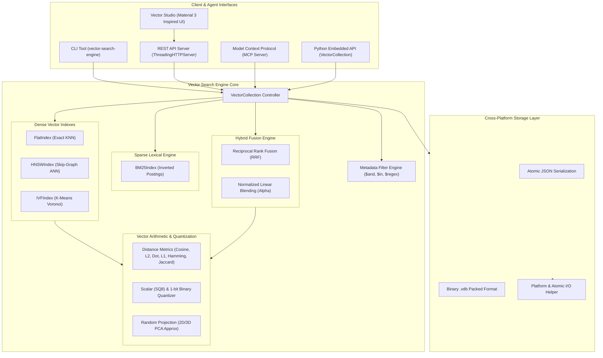

# 🔍 Vector Search Engine & Vector Studio

[](https://github.com/example/vector-search-engine/actions/workflows/ci.yml)
[](https://www.python.org/downloads/)
[](https://opensource.org/licenses/MIT)
[](pyproject.toml)
[](src/vector_search_engine/mcp_server.py)

A production-grade, **pure Python standard library (zero external runtime dependencies)** vector database and approximate nearest neighbor (ANN) search engine featuring **Hierarchical Navigable Small World (HNSW)** graph indexing, **Inverted File (IVF)** clustering, **Okapi BM25** lexical retrieval, **Hybrid Search** with **Reciprocal Rank Fusion (RRF)**, **Model Context Protocol (MCP)** server integration for AI assistants, and **Vector Studio** interactive web UI (influenced by Material 3 design).

---

## 📑 Table of Contents

- [Key Architectural Features](#-key-architectural-features)
- [System Architecture](#-system-architecture)
- [Mathematical Specifications](#-mathematical-specifications)
  - [Distance & Similarity Metrics](#1-distance--similarity-metrics)
  - [HNSW Skip-Graph Indexing](#2-hnsw-hierarchical-navigable-small-world)
  - [IVF Centroid Partitioning](#3-ivf-inverted-file-index)
  - [Hybrid Search & Fusion Formulas](#4-hybrid-search--fusion-formulas)
  - [Scalar & Binary Quantization](#5-vector-quantization)
- [Vector Studio Web UI](#-vector-studio-web-ui)
- [Model Context Protocol (MCP) Integration](#-model-context-protocol-mcp-integration)
- [Python API Quickstart](#-python-api-quickstart)
- [CLI Reference](#-cli-reference)
- [REST API Endpoints](#-rest-api-endpoints)
- [Running Tests & Benchmarks](#-running-tests--benchmarks)

---

## ⚡ Key Architectural Features

- **Zero Runtime Dependencies**: Built entirely using Python 3.9+ standard library (`math`, `heapq`, `struct`, `http.server`, `json`, `dataclasses`).
- **Multiple Index Paradigms**:
  - **Flat Index**: Exact $O(N)$ linear scan brute-force baseline with 100% recall.
  - **HNSW Index**: Multi-layer skip-graph achieving sub-millisecond logarithmic $O(\log N)$ search latency.
  - **IVF Index**: Inverted file partitioning using pure Python K-Means++ clustering.
- **Hybrid Search Engine**: Okapi BM25 inverted index tokenization combined with dense vector representations via Reciprocal Rank Fusion (RRF) and linear $\alpha$ blending.
- **Complex Metadata Filtering**: MongoDB-style query filtering ($eq, $ne, $gt, $gte, $lt, $lte, $in, $nin, $contains, $all, $regex, $exists, $and, $or, $not, $nor).
- **Dual Persistence Engines**: Human-readable atomic JSON serialization and high-density binary `.vdb` serialization.
- **Vector Studio UI**: Material 3 inspired visual studio featuring real-time 2D/3D vector space projection, HNSW multi-layer hierarchy graph inspector, hybrid search score lab, and 1-click synthetic benchmark runner.
- **Model Context Protocol (MCP) Server**: Full JSON-RPC 2.0 stdio server for Claude Desktop, Cursor, Cline, and Antigravity agents.

---

## 🏛️ System Architecture



---

## 📐 Mathematical Specifications

### 1. Distance & Similarity Metrics

| Metric | Formula | Distance Range | Similarity Formula |
| :--- | :--- | :--- | :--- |
| **Cosine** | $\cos(\mathbf{u}, \mathbf{v}) = \frac{\mathbf{u} \cdot \mathbf{v}}{\|\mathbf{u}\|_2 \|\mathbf{v}\|_2}$ | $[0.0, 2.0]$ | $S = 1.0 - D$ |
| **Euclidean (L2)** | $D_{L2}(\mathbf{u}, \mathbf{v}) = \sqrt{\sum_{i=1}^d (u_i - v_i)^2}$ | $[0.0, \infty)$ | $S = \frac{1}{1 + D}$ |
| **Dot Product** | $\mathbf{u} \cdot \mathbf{v} = \sum_{i=1}^d u_i v_i$ | $(-\infty, \infty)$ | $S = -D$ |
| **Manhattan (L1)** | $D_{L1}(\mathbf{u}, \mathbf{v}) = \sum_{i=1}^d \|u_i - v_i\|$ | $[0.0, \infty)$ | $S = \frac{1}{1 + D}$ |
| **Hamming** | $D_{\text{Hamming}}(\mathbf{u}, \mathbf{v}) = \frac{1}{d} \sum_{i=1}^d \mathbb{I}(u_i \neq v_i)$ | $[0.0, 1.0]$ | $S = 1.0 - D$ |
| **Jaccard** | $J(\mathbf{u}, \mathbf{v}) = \frac{\sum \min(u_i, v_i)}{\sum \max(u_i, v_i)}$ | $[0.0, 1.0]$ | $S = 1.0 - D$ |

---

### 2. HNSW (Hierarchical Navigable Small World)

HNSW structures vector items into a hierarchy of proximity graphs $\mathcal{G} = \{G_0, G_1, \dots, G_{L_{\max}}\}$.

#### Node Layer Assignment
The maximum layer $l$ of a newly inserted node is drawn from an exponential distribution controlled by multiplier $m_L$:

$$l = \min\left(\left\lfloor -\ln(\text{Uniform}(0, 1)) \cdot m_L \right\rfloor, L_{\max} - 1\right), \quad m_L = \frac{1}{\ln(M)}$$

#### Routing & Traversal
1. **Top-Down Greedy Routing** ($l = L_{\max} \dots l_{\text{insert}} + 1$): From entry point $v_{\text{entry}}$, greedily hop to neighbor $u \in \text{adj}(v)$ minimizing $D(\mathbf{q}, \mathbf{u})$ until a local minimum is reached.
2. **Layer Construction & Search** ($l = \min(L_{\max}, l_{\text{insert}}) \dots 0$): Beam search maintains candidate min-heap $C$ and dynamic nearest neighbor max-heap $W$ of size $ef$.
3. **Heuristic Pruning (Malkov & Yashunin Algorithm 4)**: Keeps candidates closer to query $\mathbf{q}$ than to any previously selected neighbor, ensuring diverse geometric connectivity.

---

### 3. IVF (Inverted File) Index

IVF partitions space into $K = \text{nlist}$ Voronoi cells around centroids $\{\mathbf{c}_1, \dots, \mathbf{c}_K\}$:
1. **K-Means++ Initialization**: Selects initial seeds with probability proportional to squared Euclidean distance $D^2(\mathbf{x})$.
2. **Lloyd's Clustering**: Iteratively assigns items to nearest centroids and updates centroids $\mathbf{c}_k = \frac{1}{|S_k|} \sum_{\mathbf{x} \in S_k} \mathbf{x}$.
3. **$nprobe$ Search**: Queries only the $nprobe \ll K$ nearest posting lists to reduce vector comparisons by $90\%+$.

---

### 4. Hybrid Search & Fusion Formulas

#### Okapi BM25 Lexical Ranking
Given document $D$ and query terms $Q = \{q_1, \dots, q_m\}$:

$$\text{IDF}(q_i) = \ln\left(1 + \frac{N - n(q_i) + 0.5}{n(q_i) + 0.5}\right)$$

$$\text{Score}_{\text{BM25}}(D, Q) = \sum_{i=1}^m \text{IDF}(q_i) \cdot \frac{f(q_i, D) \cdot (k_1 + 1)}{f(q_i, D) + k_1 \cdot \left(1 - b + b \cdot \frac{|D|}{\text{avgdl}}\right)}$$

where default parameters are $k_1 = 1.5, b = 0.75$.

#### Reciprocal Rank Fusion (RRF)
Combines dense rank $r_{\text{dense}}(d)$ and sparse rank $r_{\text{sparse}}(d)$:

$$\text{RRF}(d) = \frac{1}{k + r_{\text{dense}}(d)} + \frac{1}{k + r_{\text{sparse}}(d)}, \quad k = 60$$

#### Normalized Linear Alpha Blending
Min-Max normalized linear interpolation:

$$\text{Score}_{\text{linear}}(d) = \alpha \cdot \text{Norm}(\text{Score}_{\text{dense}}(d)) + (1 - \alpha) \cdot \text{Norm}(\text{Score}_{\text{sparse}}(d))$$

---

### 5. Vector Quantization

- **Scalar Quantization (SQ8)**: Compresses 32-bit floats into 8-bit unsigned integers:
  
  $$\tilde{x}_i = \left\lfloor \frac{x_i - \min(\mathbf{x})}{\max(\mathbf{x}) - \min(\mathbf{x})} \cdot 255 \right\rceil$$

- **1-Bit Binary Quantization**: Compresses 8 float signs into 1 packed byte:
  
  $$b_i = \mathbb{I}(x_i > 0)$$

---

## 🎨 Vector Studio Web UI

Vector Studio provides a clean, responsive workspace influenced by Material 3 design:

- **🌌 2D / 3D Vector Space Viewport**: High performance Canvas projection with hover tooltips, metadata coloring, and nearest neighbor trajectory links.
- **🔍 Live Search Simulator**: Real-time vector and text similarity search with animated percentage score match bars and metadata filtering.
- **🕸️ HNSW Multi-Layer Inspector**: Interactive layer visualizer with step-through greedy routing animations.
- **⚖️ Hybrid & RRF Blending Lab**: Live alpha slider ($\alpha \in [0.0, 1.0]$) with side-by-side dense vs BM25 rank comparisons.
- **⚡ Benchmark Console**: 1-click synthetic performance benchmark comparing HNSW vs Flat brute-force scan.

### Launching the Studio Server

```bash
# Start UI server on default port 8000
python -m vector_search_engine.ui_server

# Or using the CLI
vector-search serve --port 8000 --open
```

Visit `http://localhost:8000` in your web browser.

---

## 🤖 Model Context Protocol (MCP) Integration

The built-in MCP server enables AI agents (Claude Desktop, Cursor, Cline, Antigravity) to manage vector collections and execute similarity queries over stdio.

### Claude Desktop Configuration

Add to your `claude_desktop_config.json`:

```json
{
  "mcpServers": {
    "vector-search-engine": {
      "command": "python",
      "args": ["-m", "vector_search_engine.mcp_server", "--data-dir", "/path/to/vector_store"]
    }
  }
}
```

### Cursor & Cline MCP Setup

```json
{
  "name": "vector-search-engine",
  "command": "vector-search",
  "args": ["mcp", "--data-dir", "./.vector_store"]
}
```

### Registered MCP Tools

- `vector_create_collection`: Create collections with dimension, metric, and index type.
- `vector_upsert`: Upsert vector items with text document and metadata.
- `vector_query`: Query top-k nearest neighbors with vector arrays or auto-embedded text.
- `vector_hybrid_search`: Blend dense vector similarity with sparse BM25 text search.
- `vector_collection_stats`: Get collection and graph structural telemetry.
- `vector_list_collections`: List all active collections.
- `vector_embed_text`: Generate deterministic dense embeddings from raw text.
- `vector_quantize`: Compress vectors using SQ8 or 1-bit binary quantization.
- `vector_diagnostics`: Run system and engine diagnostics.

---

## 🚀 Python API Quickstart

```python
from vector_search_engine import (
    VectorCollection,
    CollectionConfig,
    DistanceMetric,
    IndexType,
    HNSWConfig,
    VectorItem,
)

# 1. Configure and initialize collection
config = CollectionConfig(
    name="ai_knowledge_base",
    dimension=4,
    metric=DistanceMetric.COSINE,
    index_type=IndexType.HNSW,
    hnsw_config=HNSWConfig(m=16, ef_construction=64, ef_search=32),
)
collection = VectorCollection(config=config)

# 2. Insert items
collection.insert(
    VectorItem(
        id="doc_1",
        vector=[0.95, 0.1, 0.2, 0.05],
        document="Attention Is All You Need: Transformer neural network architecture",
        metadata={"category": "ai", "year": 2017},
    )
)
collection.insert(
    VectorItem(
        id="doc_2",
        vector=[0.15, 0.9, 0.3, 0.1],
        document="Hierarchical Navigable Small World graphs for fast approximate nearest neighbor search",
        metadata={"category": "database", "year": 2016},
    )
)

# 3. Dense Vector Query with Metadata Filter
results = collection.query(
    query_vector=[0.9, 0.1, 0.2, 0.05],
    k=2,
    filter_expr={"year": {"$gte": 2016}},
)
for r in results:
    print(f"ID: {r.id}, Similarity Score: {r.score:.4f}, Document: {r.document}")

# 4. Hybrid Search (Dense + BM25 with RRF)
hybrid_results = collection.hybrid_search(
    query_vector=[0.9, 0.1, 0.2, 0.05],
    query_text="transformer architecture",
    k=2,
    fusion_method="rrf",
)

# 5. Save to disk (JSON or fast Binary .vdb)
collection.save_to_disk("ai_knowledge_base.vdb", format="binary")
```

---

## 💻 CLI Reference

The package provides `vector-search-engine`, `vector-search`, and `vector-engine` command-line tools:

```bash
# Create a collection
vector-search create research_papers -d 128 -m cosine -i hnsw

# Insert document with auto-embedding
vector-search insert research_papers --id p1 -d "Diffusion models for image synthesis" --meta "year=2024" --embed

# Query nearest neighbors
vector-search query research_papers -t "generative models" -k 5

# Run hybrid search
vector-search hybrid research_papers "deep learning" -a 0.5 -k 5

# View collection statistics
vector-search stats research_papers

# Run synthetic performance benchmark
vector-search benchmark -n 1000 -d 64 -k 10

# Launch Vector Studio UI
vector-search serve --port 8000

# Start MCP stdio server
vector-search mcp
```

---

## 🌐 REST API Endpoints

| Method | Endpoint | Description |
| :--- | :--- | :--- |
| `GET` | `/api/health` | Service health and uptime |
| `GET` | `/api/diagnostics` | Platform and memory diagnostics |
| `GET` | `/api/collections` | List all active collections |
| `POST` | `/api/collections` | Create a new collection |
| `GET` | `/api/collections/<name>` | Get collection info and schema |
| `DELETE` | `/api/collections/<name>` | Delete a collection |
| `POST` | `/api/collections/<name>/insert` | Insert documents/vectors |
| `POST` | `/api/collections/<name>/query` | Execute dense vector search |
| `POST` | `/api/collections/<name>/hybrid` | Execute hybrid dense + BM25 search |
| `GET` | `/api/collections/<name>/stats` | Detailed collection & HNSW stats |
| `GET` | `/api/collections/<name>/items` | Get items for 2D/3D visualization |
| `POST` | `/api/benchmark` | Execute synthetic HNSW vs Flat benchmark |

---

## 🧪 Running Tests & Benchmarks

```bash
# Run complete unit and integration test suite
pytest -v tests/

# Run CLI smoke tests
python -m vector_search_engine.cli test

# Run synthetic benchmark
python -m vector_search_engine.cli benchmark -n 1000 -d 64
```

---

## 📄 License

MIT License © 2026 Vector Search Engine Architecture Contributors.
